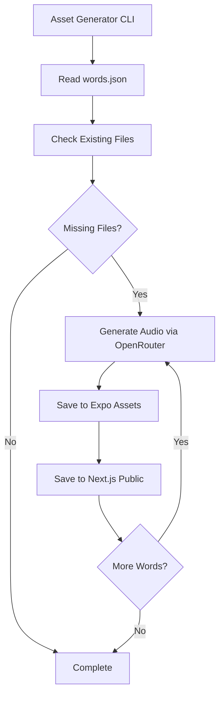

# AI Audio Asset Generator Tool

## Overview

Create a standalone tool in `packages/asset-generator` that generates Japanese TTS audio files using OpenRouter with AI SDK. The tool will use OpenAI TTS models (tts-1 or tts-1-hd) through OpenRouter to generate audio. It will scan `packages/app/features/game/data/words.json`, identify missing audio files, generate them, and save to both `apps/expo/assets/audio/` and `apps/next/public/audio/`.

## Architecture



## Implementation Details

### 1. Package Structure (`packages/asset-generator/`)

- `package.json` - Dependencies: `@openrouter/ai-sdk-provider`, `ai`, `fs-extra`, `chalk`, `commander`, `dotenv`
- `src/index.ts` - Main CLI entry point
- `src/generator.ts` - Core audio generation logic
- `src/file-utils.ts` - File system operations
- `src/config.ts` - Configuration management
- `.env.example` - Environment variable template

### 2. Key Components

**Generator (`src/generator.ts`)**:

- Read `packages/app/features/game/data/words.json`
- Check which `audioUri` files exist in both asset directories
- For missing files, use `experimental_generateSpeech` from AI SDK with OpenRouter provider
- Use OpenAI TTS model (`openrouter.speech('openai/tts-1')` or `openrouter.speech('openai/tts-1-hd')`)
- Use Japanese text (hiragana characters joined) for TTS generation
- Configure voice as 'nova' (female, clear pronunciation, supports Japanese)
- Save generated MP3 files to both locations
- Provide progress feedback and error handling

**File Utils (`src/file-utils.ts`)**:

- Check file existence in both directories
- Write files to both `apps/expo/assets/audio/` and `apps/next/public/audio/`
- Ensure directories exist

**Config (`src/config.ts`)**:

- Load OpenRouter API key from environment
- Configure OpenAI TTS model via OpenRouter (`openai/tts-1` or `openai/tts-1-hd`)
- Set voice to 'nova' (OpenAI's female voice with good Japanese support)
- Define output paths for both Expo and Next.js asset directories

**CLI (`src/index.ts`)**:

- Parse command-line arguments
- Support `--force` flag to overwrite existing files
- Support `--word-id` to generate specific word only
- Display progress and summary

### 3. OpenRouter Integration

- Use `@openrouter/ai-sdk-provider` package with `createOpenRouter()` function
- Initialize OpenRouter provider with API key from environment
- Use `openrouter.speech('openai/tts-1')` or `openrouter.speech('openai/tts-1-hd')` for TTS model
- Use `experimental_generateSpeech` from `ai` package
- Pass Japanese text (hiragana characters joined) for TTS
- Set voice to 'nova' (female, clear pronunciation)
- Request MP3 audio format (`outputFormat: 'mp3'`)
- Handle rate limiting and retries with exponential backoff

### 4. Files to Create

- `packages/asset-generator/package.json`
- `packages/asset-generator/tsconfig.json`
- `packages/asset-generator/src/index.ts`
- `packages/asset-generator/src/generator.ts`
- `packages/asset-generator/src/file-utils.ts`
- `packages/asset-generator/src/config.ts`
- `packages/asset-generator/.env.example`
- `packages/asset-generator/README.md`

### 5. Implementation Example

**Generator Code Structure**:

```typescript
import { createOpenRouter } from '@openrouter/ai-sdk-provider'
import { experimental_generateSpeech } from 'ai'

const openrouter = createOpenRouter({
  apiKey: process.env.OPENROUTER_API_KEY,
})

const { audio } = await experimental_generateSpeech({
  model: openrouter.speech('openai/tts-1-hd'),
  text: 'こんにちは', // Japanese hiragana text
  voice: 'nova', // Female voice with Japanese support
  outputFormat: 'mp3',
})

// Save audio.uint8Array to file
```

### 6. Usage

```bash
# Generate missing audio files
yarn workspace asset-generator generate

# Generate specific word
yarn workspace asset-generator generate --word-id konnichiwa

# Force regenerate all files
yarn workspace asset-generator generate --force
```

## Dependencies

- `@openrouter/ai-sdk-provider` - OpenRouter provider for AI SDK
- `ai` - Vercel AI SDK core (provides `experimental_generateSpeech`)
- `fs-extra` - Enhanced file system operations
- `chalk` - Terminal colors for progress display
- `commander` - CLI argument parsing
- `dotenv` - Environment variable loading
- `typescript` - TypeScript support
- `@types/node` - Node.js type definitions